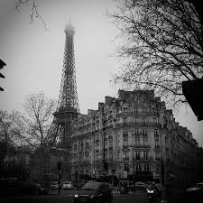
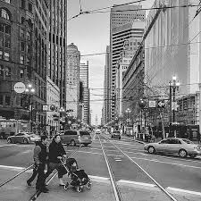
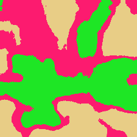
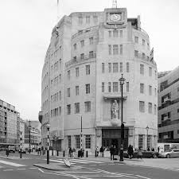
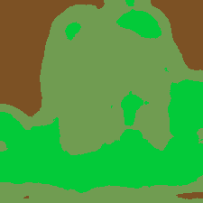
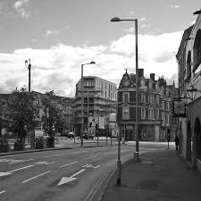
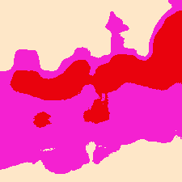
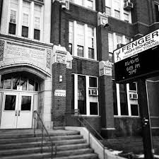
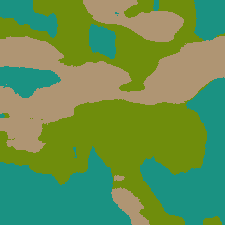

# Texture-Based Image Segmentation

This repository contains a classical approach to texture-based segmentation of urban images using directional filters, multi-scale feature extraction, and K-Means clustering.

## 🧪 Features

Classic image segmentation without deep learning

Directional texture filters (horizontal, vertical, diagonal, circular)

Multi-scale filtering using Gaussian pyramid

Texture feature extraction via local averaging

Clustering using K-Means (from scikit-learn)

Output visualization in both color and grayscale

## ▶️ How to Run

### 1. Clone the repository

git clone https://github.com/yourusername/Texture_Segmentation.git

cd Texture_Segmentation

### 2. Install dependencies

pip install -r requirements.txt

### 3. Run the pipeline

python3 main.py

### 4. Results will be saved in the data/output

## 🔍 Method Overview
Directional Filtering: Applies horizontal, vertical, diagonal, and circular filters.

Multi-Scale Analysis: Generates texture responses at multiple scales.

Texture Feature Extraction: Averages filter responses within local windows.

K-Means Clustering: Groups pixels based on their texture feature vectors.

## 📸 Results

The method produced coherent and visually meaningful segmentations across various urban scenes. Homogeneous regions like the sky were successfully distinguished from highly textured regions such as buildings and cars. While larger patterns were clearly segmented, finer details sometimes merged into broader clusters due to the averaging process. Adjusting the number of clusters or window size allows for control over segmentation granularity.

  
  

  
  

  
  

  
  

  
  

